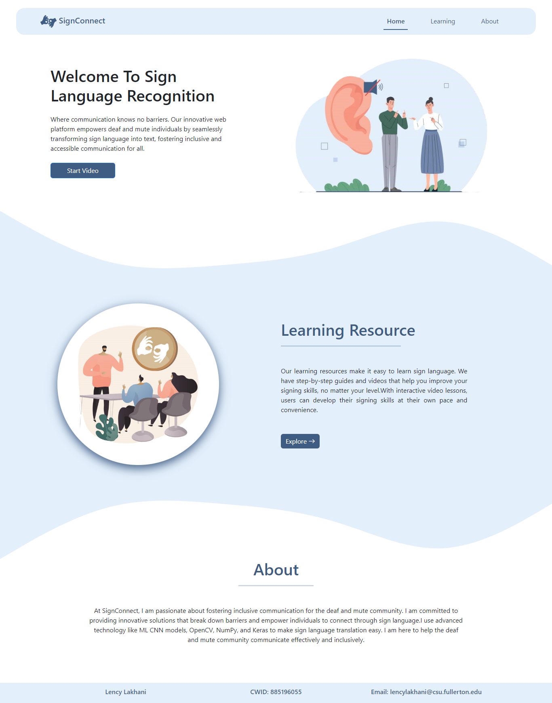
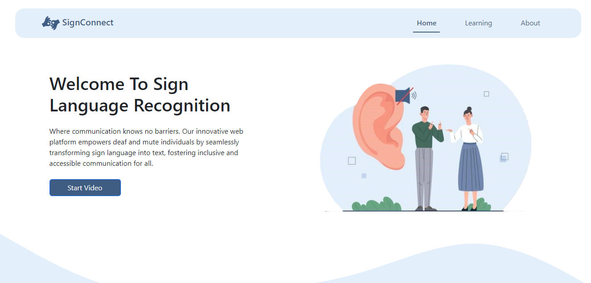
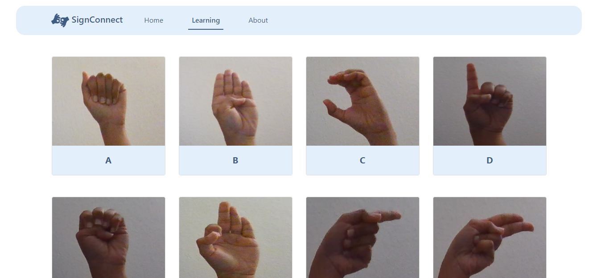
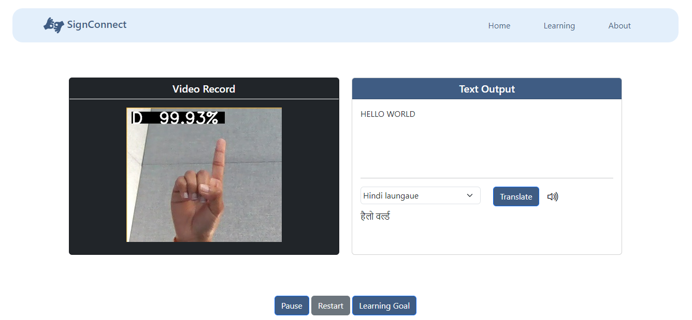
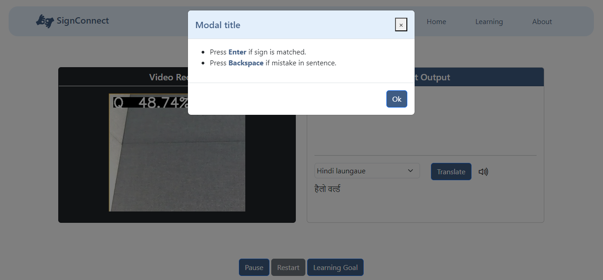

# Sign To Text Conversion for Deaf and Mute People

## Overview

This project aims to create a solution for converting sign language gestures into text to facilitate communication for the deaf and mute community. It utilizes computer vision techniques for hand gesture recognition, deep learning for training a Convolutional Neural Network (CNN) model, and web technologies for creating an interactive user interface.

## Features

- **Start video button:** Initiates the video feed for sign language gesture recognition.
- **Learning section:** Provides insights into the project and sign language.
- **About section:** Offers information about the project and its objectives.
- **Hand sign dataset collection:** Implemented using `createDataset.py` script to gather hand sign images for training.
- **Data preprocessing:** Converts collected images into black and white format to avoid overfitting using `convertDatasetToBW.py`.
- **Dataset splitting:** Utilizes `splitDataset.py` script to divide the dataset into 80% training and 20% validation sets.
- **Training of CNN model:** Utilizes Keras and TensorFlow to train a CNN model achieving 98% training and 99% validation accuracy.
- **Display of video feed:** Presents the video feed and corresponding text output on the frontend for user interaction.
- **Multiple language translation:** Integration with Google Translate API for text translation into various languages.
- **Voice-over feature:** Utilizes API for converting text to speech, enhancing accessibility for users.
- **Video controls:** Allows users to pause, restart, and rewind the video feed.
- **Sentence formation:** Users can construct sentences by pressing the "Enter" key and correct mistakes using the "Backspace" key.

## Technologies Used

- Frontend:
  - HTML
  - CSS
  - JavaScript
  - jQuery
  - AJAX
  
- Backend:
  - Flask
  - OpenCV
  
- Machine Learning:
  - Keras
  - TensorFlow
  - NumPy
  
- APIs:
  - Google Translate API(Rapid API)
  - Text-to-Speech API(Rapid API)

## Usage

1. Clone the repository:

    ```bash
    git clone https://github.com/LencyLakhani/SignToText_Using_CNN.git
    ```

2. Install dependencies:

    ```bash
    pip install -r requirements.txt
    ```

3. Run the Flask application:

    ```bash
    python application.py
    ```

4. Access the application through a web browser at `http://localhost:5000`.

## Screenshots

<div>






</div>

## Credits

- **Author:** Lency Lakhani
- **Email:** lencylakhani@outlook.com
- **GitHub:** https://github.com/LencyLakhani

## License

This project is licensed under the [MIT License](LICENSE).
